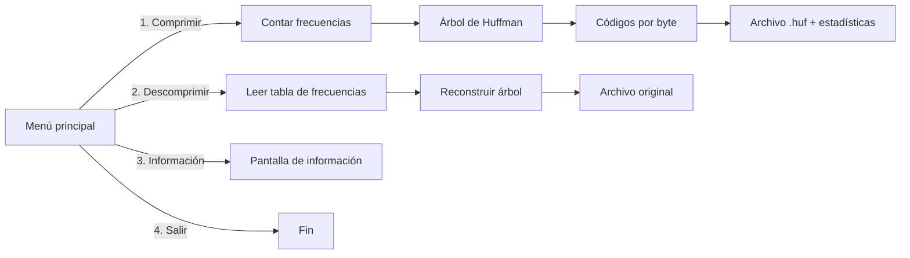

# Compresor de Archivos Huffman

Programa de consola en C++ que comprime y descomprime cualquier archivo usando el **algoritmo de Huffman**, y muestra el tamaño original, el tamaño comprimido y el porcentaje de compresión. Hecho para el curso **Estructuras de Datos**.

<p align="center">
  
  
  
  
</p>

---

## Tabla de Contenidos
- [Características](#características)
- [Autores](#autores)
- [Cómo Funciona](#cómo-funciona)
- [Arquitectura](#arquitectura)
- [Tecnologías](#tecnologías)
- [Estructura del Proyecto](#estructura-del-proyecto)
- [Cómo Ejecutar](#cómo-ejecutar)
- [Qué Aprendí](#qué-aprendí)
- [Licencia](#licencia)

---

## Características
* Comprime cualquier tipo de archivo (texto, imágenes BMP, etc.) a un archivo `.huf`.
* Descomprime archivos `.huf` y recupera el archivo original.
* Muestra estadísticas de compresión: tamaño original, tamaño comprimido y porcentaje de reducción.
* Advierte cuando el archivo ya está comprimido (`.exe`, `.jpg`, `.png`, `.mp3`, `.zip`, etc.), porque comprimirlo de nuevo rara vez sirve.
* Menú de consola con colores y arte ASCII.
* Manejo de errores, por ejemplo cuando el archivo no existe o la extensión no es `.huf` al descomprimir.

---

## Autores
* **Christopher Daniel Vargas Villalta** – [@chris124v](https://github.com/chris124v)
* Santiago Espinoza Rendón

**Curso:** Estructuras de Datos

---

## Cómo Funciona
**Compresión**
1. Se lee el archivo byte por byte y se cuenta cuántas veces aparece cada byte (tabla de frecuencias).
2. Se construye el árbol de Huffman con una cola de prioridad: se unen repetidamente los dos nodos de menor frecuencia hasta quedar un solo árbol.
3. Se recorre el árbol para asignar un código binario a cada byte: los más frecuentes reciben códigos más cortos.
4. Se escribe el archivo `.huf` con el siguiente formato:

| Parte | Contenido |
|-------|-----------|
| Encabezado | Cantidad de bytes distintos y la tabla de frecuencias (byte + frecuencia) |
| Relleno | Cantidad de bits de relleno del último byte |
| Datos | Los códigos de Huffman empaquetados en bytes con operaciones de bits (`setBit`, `getBit`) |

**Descompresión**: se lee la tabla de frecuencias, se reconstruye el mismo árbol y se recorre bit por bit (0 = izquierda, 1 = derecha) escribiendo un byte cada vez que se llega a una hoja.

---

## Arquitectura
Programa de consola en C++ dividido en la interfaz (`Interface.h`), las definiciones del algoritmo (`huffman.h`) y la implementación con el `main` (`Proyecto 3A.cpp`).



**Estructuras de datos utilizadas**
* **Árbol binario** (`Node`) para el árbol de Huffman.
* **Cola de prioridad** (`std::priority_queue`) para elegir siempre los nodos de menor frecuencia.
* **Mapas** (`std::map`) para la tabla de frecuencias y la tabla de códigos.
* **Operaciones de bits** para empaquetar y leer los códigos en el archivo comprimido.

---

## Tecnologías
* C++ con Visual Studio 2022 (toolset v143, Windows).
* Solo biblioteca estándar de C++ (`<fstream>`, `<queue>`, `<map>`, etc.). Sin dependencias externas.

---

## Estructura del Proyecto
```text
Proyecto-3A/
├── Proyecto 3A.sln          # Solución de Visual Studio
├── Proyecto 3A/
│   ├── Proyecto 3A.cpp      # main, algoritmo de Huffman e interfaz
│   ├── huffman.h            # Nodo del árbol, comparador y prototipos del algoritmo
│   └── Interface.h          # Colores, menús y arte ASCII
├── LICENSE
└── README.md
```

---

## Cómo Ejecutar

### Requisitos previos
* Windows con **Visual Studio 2022** y el componente *Desarrollo para el escritorio con C++*.

### Inicio rápido
1. Clonar el repositorio y abrir `Proyecto 3A.sln` en Visual Studio.
2. En `Proyecto 3A/Proyecto 3A.cpp`, dentro de `main`, cambiar la variable `dataPath` por una carpeta de tu computadora, por ejemplo `C:\\Users\\TuUsuario\\Huffman\\Data\\`. Los archivos a comprimir y los resultados se leen y guardan ahí.
3. Crear esa carpeta y poner dentro un archivo de prueba (por ejemplo `prueba.txt`).
4. Ejecutar con **F5**.

### Guía de uso
1. Elegir **1** para comprimir o **2** para descomprimir.
2. Escribir el nombre del archivo con su extensión (por ejemplo `prueba.txt`).
3. Comprimir genera `prueba.txt.huf` y muestra las estadísticas. Descomprimir genera `prueba_decompressed.txt`.

### Notas
* Para descomprimir, el nombre debe terminar en `.huf` (por ejemplo `prueba.txt.huf`).
* Los archivos que ya vienen comprimidos (`.jpg`, `.mp3`, `.zip`, etc.) casi no se reducen, e incluso pueden crecer.

---

## Qué Aprendí
* A implementar el algoritmo de Huffman: tabla de frecuencias, árbol binario, cola de prioridad y generación de códigos.
* A manipular bits para guardar los códigos de longitud variable en bytes, incluyendo el relleno del último byte.
* A leer y escribir archivos en modo binario y a medir la eficiencia con el porcentaje de compresión.
* Con más tiempo: guardar la ruta de datos en un parámetro o en un archivo de configuración en lugar de dejarla fija en el código, y liberar la memoria del árbol al terminar.

---

## Licencia
Distribuido bajo la licencia MIT. Ver [`LICENSE`](LICENSE) para más detalles.
